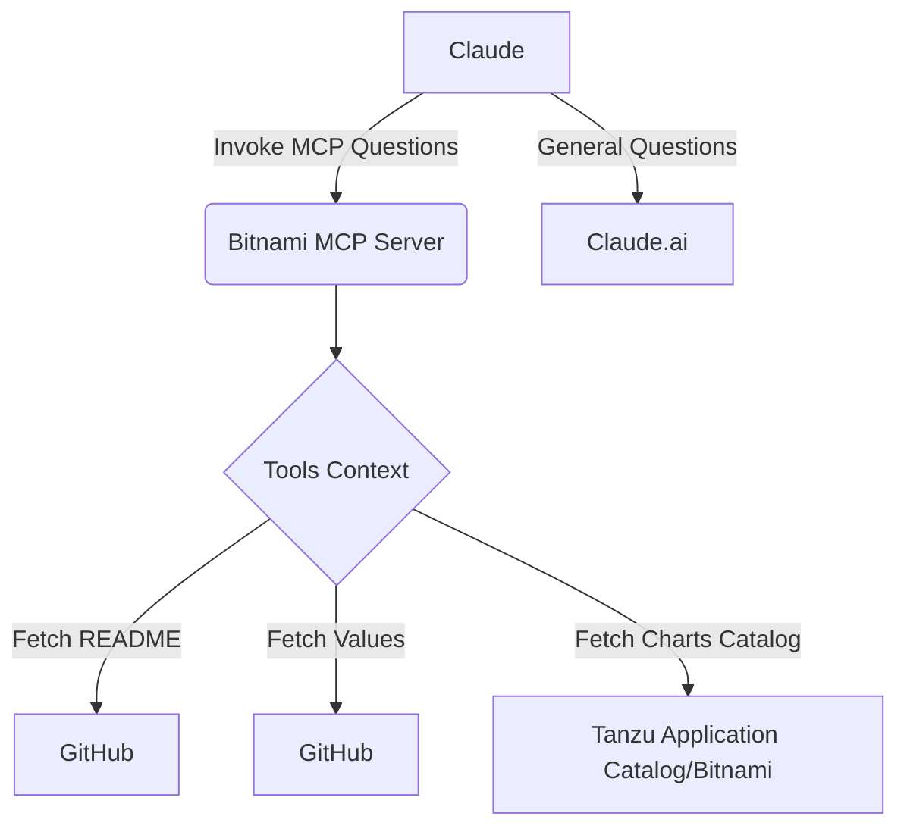

# Bitnami Secure Images / Tanzu Application Catalog (TAC) claude-mcp-demo
A demo on how to integrate Bitnami Helm charts with Helm charts from Bitnami Secure Images and Tanzu Application Catalog.

*Note: This is a demo/proof of concept. It is not meant to be part of Bitnami Secure Images or Tanzu Application Catalog and rather it is meant to serve as a demonstration of how easy it can be to integrate Bitnami Helm charts as a source of data to AI agents. 

This project is built with [Spring AI](https://spring.io/projects/spring-ai). I highly recommend [Dan Vega's introduction to MCP video](https://www.youtube.com/watch?v=w5YVHG1j3Co) as a quick way to get you ramped up with [Model Context Protocol](https://github.com/modelcontextprotocol). 

# Architecture
As with most MCP applications the architecture is actually quite simple. Note also that I have just tested this project in stdio mode, although I don't see any reason why it wouldn't work in HTTP SSE mode. 



# How it works
The project is actually very simple and most of the logic is inside he Helm service. I'm using only [MCP tools](https://modelcontextprotocol.io/docs/concepts/tools) but I admit this is not a deliberated choice but rather a lets-use-what-everyone-else-is-using kind of choice. It kind of feels that there are better ways to do this, like for example [MCP resources](https://modelcontextprotocol.io/docs/concepts/resources), but as I could only make Claude to understand tools that was the quickest way to demo state. I don't discard revisiting the whole flow or if you happen to know how to integrate this better then do not hesitate letting me know through issues or PRs. 

At a glance, the MCP Application instructs Spring AI to introspect tools:

```java
    @Bean
    public List<ToolCallback> bitnamiTools(HelmService helmService) {
        return List.of(ToolCallbacks.from(helmService));
    }
```

And the Helm service defines the different tool methods:

```java
    @Tool(name = "get_helm_chart", description = "Get a single Helm chart as long as it is available in your Bitnami Premium or Tanzu Application Catalog subscription.")
    ApplicationMetadata getHelmChart(String name) {
        return applications.stream().filter(it -> it.name().equals(name)).findFirst().orElse(null);
    }
    ...
```

This MCP fetches data for the LLM from two places:

1. The catalog of available Helm charts and their versions is fetched form an OCI registry. Your Tanzu Application Registry or any other registry that has a charts-index.json file. This is a little-known file that emulates what a Helm index does but that lives in Tanzu Application Catalog registries as an OCI artifact. It becomes pretty useful to consume data, specially on a disconnected fashion and it is something that tools like [Charts syncer](https://github.com/bitnami/charts-syncer) can rely upon.

2. To fetch the docs and values, rather than extracting the Charts tgz package (which we perfectly could), it is just simpler to fetch those from GitHub directly. In practice there can be subtle variations but for the sake of this demo it is just simpler to fetch the README and values files from GitHub directly

# Building
```console
mvn clean package
```

# Configuring Claude

NOTE: If you plan to test asking questions about README or values configuration then you will need a *Claude Pro* subscription. I found that with Claude Desktop free, the context window is too short and returns errors. 

Find the Claude configuration file. In a Mac is in  ~/Library/Application\ Support/Claude/claude_desktop_config.json. You might need to go to Claude Desktop's developer settings for the file to be created for the first time. And add the following:

```json
{
    "mcpServers": {
        "bitnami-mcp": {
            "command": "/Users/martinpe/.sdkman/candidates/java/current/bin/java",
            "args": [
                "-jar",
                "/Users/martinpe/workspace/mcp/target/mcp-0.0.1-SNAPSHOT.jar"
            ],
            "env": {
                "OCI_REGISTRY":"https://us-east1-docker.pkg.dev/vmw-app-catalog/hosted-registry-...",
                "OCI_REGISTRY_USERNAME":"_json_key_base64",
                "OCI_REGISTRY_PASSWORD":"ewogICJ0eXBlIjogInNlcn....."
            }
        }
    }
}
```

On the above you will need to adjust the following values accordingly:

1. _command_: Needs to point to the absolute path of your JDK
2. _args_: Needs to point to the absolute path of the jar file for the MCP server that you built in the previous step.
3. _env_: The three variables that point to your TAC registry. If your company owns the registry, then you probably already know your credentials. If it is Tanzu Application Catalog who hosts the registry for you then you can [follow this guide](https://techdocs.broadcom.com/us/en/vmware-tanzu/application-catalog/tanzu-application-catalog/services/tac-doc/get-started-index.html#obtaining-registry-credentials).

# Testing it

Finally start Claude Desktop and you should be able to ask questions about Helm charts. Once you ask a question, Claude will ask you for confirmation to run tools on the registered MCP server. 

```
Martin: What Infrastructure Helm charts do I have available in Bitnami?

Claude: Let me check what Infrastructure category Helm charts are available in your Bitnami Secure Images or Tanzu Application Catalog subscription.

> View result from get_helm_charts from bitnami-mcp (local)

Here are the Infrastructure category Helm charts available in your Bitnami Secure Images or Tanzu Application Catalog subscription:

1. Apache ZooKeeper
Description: A reliable, centralized register of configuration data and services for distributed applications.
Category: Infrastructure

2. Apache Kafka
Description: A distributed streaming platform designed to build real-time pipelines and can be used as a message broker or as a replacement for a log aggregation solution for big data applications.
Category: Infrastructure

3. Milvus
Description: A cloud-native, open-source vector database solution for AI applications and similarity search. Features high scalability, hybrid search and unified lambda structure.
Category: Infrastructure

These three Helm charts are specifically categorized as Infrastructure. There are also other related categories like Etcd (NoSQL) and MinIO (Developer Tools) that might be useful for infrastructure purposes, depending on your specific needs.
....
```

# Possible improvements

There are many things that can be improved in additional interations on this very simplistic tool, like for example:

* Consume the whole Helm template and use it to get additional context and suggestions
* Integrate with the actual GitHub Bitnami issues, pull requests or changelog to get better answers for issues, solutions, recommendations or changes across versions
* Implement support to run actual Helm commands like what the [Kubernetes MCP server does](https://github.com/Flux159/mcp-server-kubernetes/blob/main/src/tools/helm-operations.ts).

